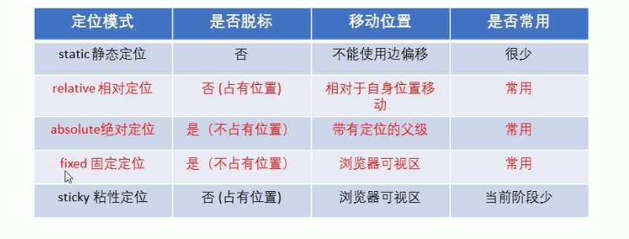
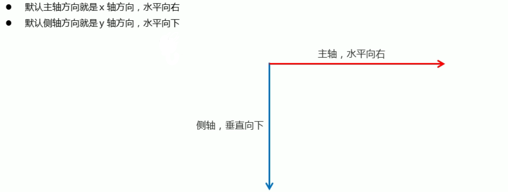
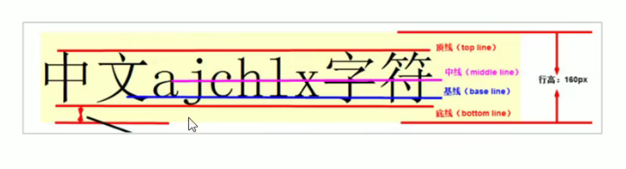
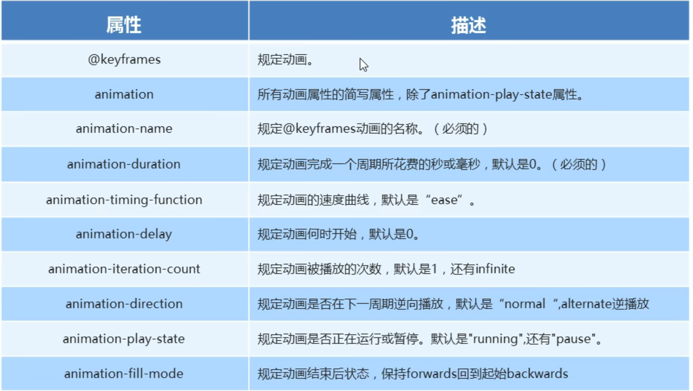
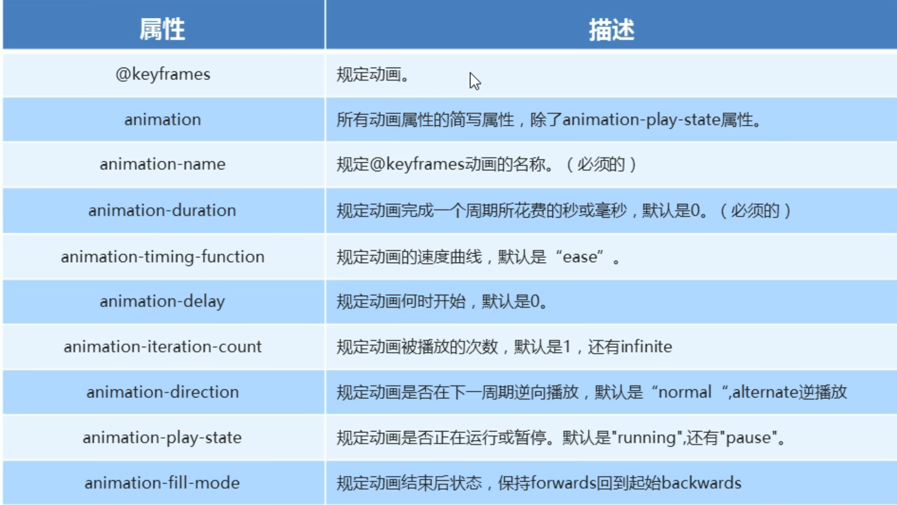
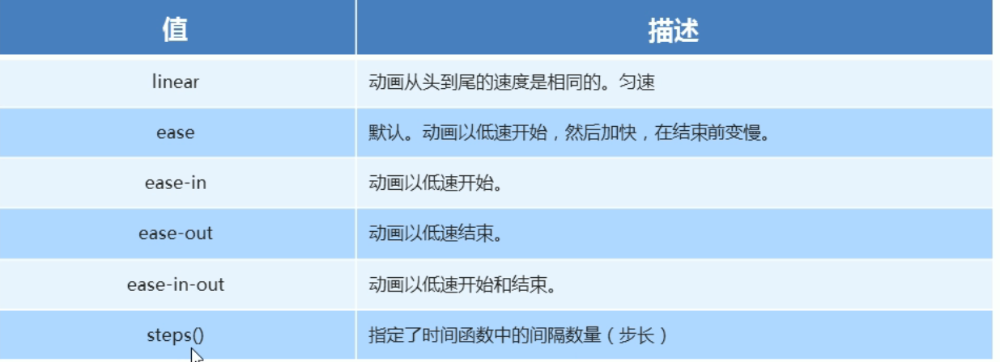
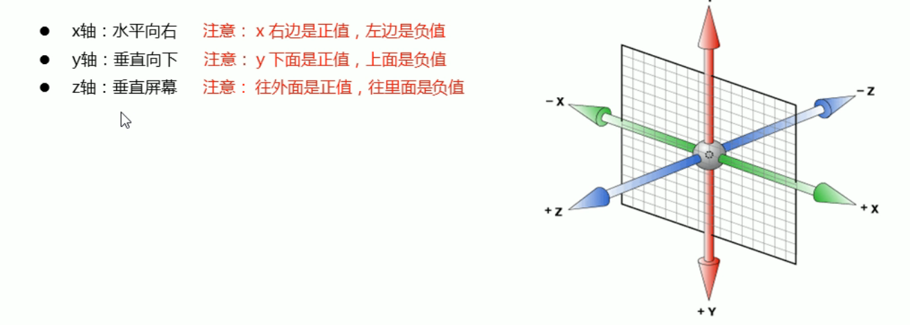
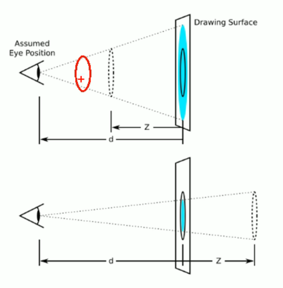
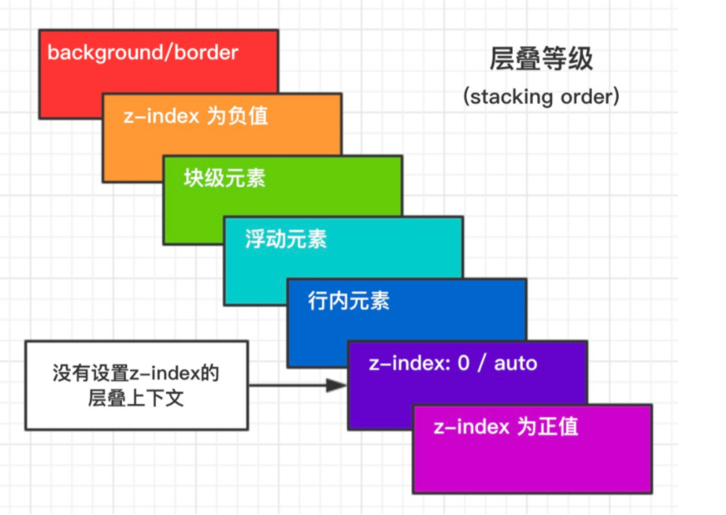

# CSS知识点

## 浮动-float

float属性用于创建浮动框，将其移动到一边，直到左边缘或右边缘触及包含块或另一个浮动框的边缘。

float属性的属性值含义：

| 属性值 | 描述         |
| ------ | ------------ |
| none   | 元素不浮动   |
| left   | 元素向左浮动 |
| right  | 元素向右浮动 |

### 浮动特性

* 脱离标准流的控制（脱标），移动到指定位置。
* 浮动的盒子不再保留原先的位置。
* 如果多个盒子都设置了浮动，则他们会按照属性值一行内显示并且顶端对齐排列。浮动的元素是互相贴靠在一起 的（没有缝隙），如果父级宽度装不下这些浮动的盒子，多出的盒子会**另起一行对齐**。
* 任何元素都能添加浮动特性，浮动元素会具有行内块元素特性。**行内元素给了float属性后可以直接指定宽高**。

**通常先用标准流的父元素排列上下排列后，内部子元素采取浮动排列左右位置。**

### 浮动元素布局注意点

* 通常与标准流的父级元素同用进行约束
* 一个元素是浮动的通常兄弟元素也应该浮动：浮动的盒子只会**影响浮动盒子后面的标准流**，**不会影响前面的标准流。**

### 清除浮动

本质：清除浮动元素造成的影响。可以采用闭合浮动的方法。父元素高度随子孩子个数变化。

#### 属性clear

| 属性值 | 描述                       |
| ------ | -------------------------- |
| left   | 不允许左侧有浮动元素       |
| right  | 不允许右侧有浮动元素       |
| both   | 同时清除左右两侧浮动的影响 |

#### 清除浮动的方法

1. 额外标签法（隔墙法）
   在浮动元素后添加一个空标签例如 `</br>，<div style="clear:both"></div>。`**新增元素必须是块级元素。**
2. 父级添加overflow属性
   overflow:hidden|auto|scroll   无法显示溢出部分
3. 父级添加:==after伪元素==
   ```css
   .clearfix::after{
       content:"";
       display:block;
       height:0;
       clear:both;
       visibility: hidden;
   }
   ```
4. 父级添加双伪元素
   ```css
   .clearfix::before, .clearfix::after{
      content:"",
      display:table;
   }
   .clearfix:after{
      clear:both;
   }
   .clearfix{
     *zoom:1
   }
   ```

## 定位-position

可以让盒子自由的在某个盒子内移动位置或者固定在屏幕中的某个位置，并且可以压住其他盒子。

定位 = 定位模式（指定元素在文档中的定位位置） + 边偏移（决定了该元素的最终位置）

### 定位模式

通过position属性来设置

| 值       | 语义                                                                                                                       |
| -------- | -------------------------------------------------------------------------------------------------------------------------- |
| static   | 静态定位                                                                                                                   |
| relative | 相对定位，元素移动位置是相对于它自身原位置而言的(原位置左上角坐标为移动坐标原点)，并且原位置仍保留                         |
| absolute | 绝对定位，**相对于最近一级有定位的祖先元素移动**，若无祖先元素或祖先元素无定位则以浏览器为准定位。不再占有原有位置。 |
| fixed    | 固定定位，浏览器页面滚动但是元素显示固定。以浏览器可视窗口为参照点，跟父元素没有关系，不占有原先位置。                     |

==子绝父相==



加了**绝对定位的盒子无法通过 margin 0 auto进行居中**。使用left走父元素的50%，再用margin-left走自身宽度的一半（-width/2）。

sticky: fixed+absolute

元素根据正常文档流进行定位，然后相对它的*最近滚动祖先（nearest scrolling ancestor）*和 [containing block](https://developer.mozilla.org/en-US/docs/Web/CSS/Containing_block) (最近块级祖先 nearest block-level ancestor)，包括table-related元素，基于`top`, `right`, `bottom`, 和 `left`的值进行偏移。偏移值不会影响任何其他元素的位置。

该值总是创建一个新的[层叠上下文（stacking context](https://developer.mozilla.org/en/docs/Web/CSS/CSS_Positioning/Understanding_z_index/The_stacking_context)）。注意，一个sticky元素会“固定”在离它最近的一个拥有“滚动机制”的祖先上（当该祖先的`overflow` 是 `hidden`, `scroll`, `auto`, 或 `overlay`时），即便这个祖先不是最近的真实可滚动祖先。这有效地抑制了任何“sticky”行为

**注意点：**

* 行内元素添加**绝对定位或相对定位**也能设置高宽。
* 浮动元素只会压住标准流的盒子，但不会压住下面标准流盒子里的文字。但**绝对定位、固定定位**会压住下面标准流的所有内容。

### 边偏移

边偏移就是定位盒子移动到的最终位置。由以下四个属性决定

| 边偏移属性 | 示例     | 描述                                         |
| ---------- | -------- | -------------------------------------------- |
| top        | top:80px | 顶端偏移量，定义元素相对于父元素上边线的距离 |
| bottom     |          | 底部偏移量                                   |
| left       |          | 左侧偏移量                                   |
| right      |          | 右侧偏移量                                   |

### 定位叠放次序-z-index

使用定位布局时，可能会出现盒子重叠的情况。此时，可以使用z-index来控制盒子的前后次序

数值可以是正数，负数或0，默认是auto,数值越大，盒子越靠上。属性值相同则按照书写顺序后来居上。数字后不能加单位。**只有定位盒子有该属性。**

子大于父，兄弟节点后来居上（firefox auto），回到同级比较

## flex

### 与传统布局相比的优劣

**传统布局**

* 兼容性好
* 布局繁琐
* 局限性，不能在移动端很好的布局

**flex布局**

* 操作方便，布局简单，移动端应用广泛
* PC端浏览器支持情况较差
* IE11或更低版本不支持或仅部分支持

---

### flex布局原理

flex是flexible Box的缩写，意为弹性布局，任何一个容器都可以指定为flex布局。通过给父盒子添加flex属性，来控制子盒的位置和属性。

**当指定父盒子为flex布局后，子元素的float，clear和vertical-align属性将失效**

---

### flex布局父项常见属性

* **flex-drection**：设置主轴方向

  

  | 属性值         | 说明             |
  | -------------- | ---------------- |
  | row            | 默认值，从左到右 |
  | row-reverse    | 从右到左         |
  | column         | 从上到下         |
  | column-reverse | 从下到上         |
* **justify-content**：设置主轴上子元素的排列方式

  ！！注意使用之前确定好主轴是哪个

  | 属性值        | 说明                                                      |
  | ------------- | --------------------------------------------------------- |
  | flex-start    | 默认值从头部开始，如果主轴是x轴则从左到右                 |
  | flex-end      | 从尾部开始排列。和row-reverse的区别是不会改变元素排列顺序 |
  | center        | 从主轴居中对齐（主轴是x轴则水平居中）                     |
  | space-around  | 平分剩余空间                                              |
  | space-between | 先两边贴边再平分剩余空间                                  |
* **flex-wrap**：设置子元素是否换行

  若一个轴向摆放不下所有子元素，flex默认不换行，而会缩小子元素的宽度放到父元素里。

  | 属性值 | 说明           |
  | ------ | -------------- |
  | nowrap | 默认值，不换行 |
  | wrap   | 换行           |
* **align-content**：设置侧轴上的子元素的排列方式（多行）

  适用于子元素换行的情况

  | col1          | col2                                   |
  | ------------- | -------------------------------------- |
  | flex-start    | 侧轴头部开始排列                       |
  | flex-end      | 侧轴尾部开始排列                       |
  | center        | 居中                                   |
  | space-around  | 在侧轴平分剩余空间                     |
  | space-between | 子项在侧轴先分布在两头，再平分剩余空间 |
  | stretch       | 设置子项元素高度平分父元素高度         |
* **align-items**：设置侧轴上子元素的排列方式（单行）

  | 属性值     | 说明                     |
  | ---------- | ------------------------ |
  | flex-start | 从上到下                 |
  | flex-end   | 从下到上                 |
  | center     | 挤在一起居中（垂直居中） |
  | stretch    | 拉伸（默认值）           |
* **flex-flow**：复合属性，相当于同时设置了flex-direction和flex-wrap

---

### flex布局子项常见属性

* flex：子项对剩余空间占有的份数

  * [`flex-grow`](https://developer.mozilla.org/zh-CN/docs/Web/CSS/flex-grow)：扩张占剩余空间的份数，默认0
  * [`flex-shrink`](https://developer.mozilla.org/zh-CN/docs/Web/CSS/flex-shrink)：收缩相对自身的份数，默认1
  * [`flex-basis`](https://developer.mozilla.org/zh-CN/docs/Web/CSS/flex-basis)：元素在主轴初始化大小，默认auto
* align-self：控制子项自己在侧轴的排列方式
* order：属性定义子项的排列顺序

## 元素显示与隐藏

* display属性：none隐藏对象（不占有原位置），block除了转换为块级元素外还有显示元素的意思。
* visibility属性：visible(可见)， hidden(隐藏，继续占有原位置)
* overflow属性（溢出显示）：visible(默认，显示)，hidden（隐藏），scroll（溢出的部分显示滚动条），auto(需要时添加滚动条）

## grid(待看)

## CSS高级技巧

### 精灵图

为了有效减少服务器接收和发送请求的次数，提高页面的加载速度，出现了CSS精灵技术（也称CSS Sprites\CSS雪碧）

核心原理：将网页中的小背景图像整合到一张大图中，这样服务器就只需要请求1次就可以了。通过**background-position**移动整张大图让盒子内显示的为需要的图片（x,y坐标）。

### 字体图标

以图片的形式展示，但是具有同字体一样可编辑的属性（颜色大小等）。几乎所有浏览器都适用。适用于简单的小图标。

从[阿里图标库](https://www.iconfont.cn/help/detail?spm=a313x.7781069.1998910419.d8d11a391&helptype=code)看引入和使用方式

### CSS三角

```CSS
/* 宽高为0设置border来实现,三角形大小通过改变border宽来实现 */
.triangle{
    width: 0;
    height: 0;
    /* 除去要显示三角的边其他边变透明 */
    border : 10px solid transparent;
    /* 尖角向右的粉色三角 */
    border-left-color: pink;
    / * 照顾低版本浏览器兼容性问题 */
    line-height: 0;
    font-size: 0;
}
```

### CSS用户界面样式

#### 更改用户鼠标样式

cursor属性

| 属性值      | 描述     |
| ----------- | -------- |
| default     | 默认鼠标 |
| pointer     | 小手🖐   |
| move        | 移动💠   |
| text        | 文本 I   |
| not-allowed | 禁止🚫   |

#### 表单轮廓与表单域防止拖拽

对input元素内添加 **outline:0/outline:none** 去除表单输入时的轮廓线

对textarea添加 **resize: none**

### vertical-align属性

用于设置图片或表单（行内块元素）和文字的垂直对齐。只针对**行内元素或行内块元素**有效。



| 值       | 描述                                  |
| -------- | ------------------------------------- |
| baseline | 默认。元素放置在父元素的基线上        |
| top      | 元素顶端对齐                          |
| middle   | 把元素放置在父元素的中部（垂直居中 ） |
| bottom   | 元素底端对齐                          |

可以通过使用该属性解决图片底部默认空白缝隙的问题。（原本图片默认是基线对齐的所以会产生空白缝隙）。或者将图片转换为块级元素也可以除掉图片底部空白缝隙。

### 文字溢出省略号显示

#### 单行文本

```CSS
/*1. 强制一行内显示文本 */
white-space: nowrap; （默认值为normal换行）
/*2.超出部分隐藏 */
overflow: hidden;
/*3.文字用省略号代替超出的部分 */
text-overflow: ellipsis;
```

#### 多行文本

有较大兼容性问题，适合于webKit浏览器或移动端（移动端大部分是webkit内核），更推荐让后台人员来设置这个kuaover-flow: hidden;

```css
text-overflow: ellipsis;
/* 弹性盒子模型显示 */
display: -webkit-box;
/* 限制在一个块级元素显示的文本的行数 */
-webkit-line-clamp: 2;
/* 设置或检索伸缩盒子对象的子元素的排列方式  垂直居中*/
-webkit-box-orient: vertical;
```

#### 跨浏览器兼容

```css
p {
    position:relative;
    line-height:1.4em;
    /* 3 times the line-height to show 3 lines */
    height:4.2em;
    overflow:hidden;
}
p::after {
    content:"...";
    font-weight:bold;
    position:absolute;
    bottom:0;
    right:0;
    padding:0 20px 1px 45px;
}
```

### 常见布局技巧

#### margin负值运用-细线边框

如果border为1px,两个盒子浮动时边框重叠在一起会有一条“粗边框”，margin-left=-1px可消除这个粗边框效果。为盒子添加**相对定位**提高盒子的优先级，避免选中当前盒子时，边线被其他盒子压住而无法显示重叠边线的问题。(如果盒子已经有定位则加z-index提高盒子优先级)

#### 文字围绕浮动元素

利用浮动元素只压住标准流盒子而不会压住文字的特性（浮动本就是为文字环绕设计的），将图片盒子设置为absolute，文字为标准流即可实现文字环绕图片的效果。

#### 行内块元素的运用

行内块元素制作页码及跳转，直接看常见布局技巧.html

#### CSS三角强化

直角三角制作。效果如下图，看常见布局技巧.html

```CSS
/* 直角三角 */
        .right-triangle {
            /* 尖角指向左侧的直角三角 */
            border-color: transparent red transparent transparent;
            border-style: solid;
            /* 高度比宽度稍大的直角三角 */
            border-width: 100px 50px 0 0;

        }
```

# CSS3新增

属性选择器，结构伪类选择器， 伪元素选择器，2d转换， 3d转换，动画，浏览器私有前缀

## 1. 过渡（transition）属性

transition: 要过渡的属性(全部all) 花费时间(s) 运动曲线(默认ease,可省略) 何时开始(s, 可省略)；谁做过渡给谁加。多个属性逗号分隔。


## 2. 2D转换

  实现元素位移、旋转、缩放等效果

* tanslate(移动)，不会影响到其他元素的位置，%是相对于**自身元素**，对行内标签没有效果。单位可以是%或px。

  * transform: translate(x, y);
  * transform: translateX(n);
  * transform: translateY(n);
  * 定位+transform实现水平垂直居中

    ```javascript
    {
         /* 定位走父盒子高宽的一半 */
          position: absolute;
          top: 50%;
          left: 50%;
          width: 50px;
          height: 50px;
          background-color: cornsilk;
          /* tanslate向上左走自身高宽的一半 */
          transform: translate(-50%, -50%);
      }
    ```
* rotate(旋转)，transform: rotate(度数)，度数单位为deg，角度为正时顺时针反之逆时针，默认旋转中心点为元素的中心点(50%,50%))。设置旋转中心点：transform-origin：x y (% 像素 方位名词（top,bottom,left,right,center）)
* scale(缩放)，transform: scale(x, y)，xy为倍数不带单位,只有一个参数则第二个参数和第一个一样。不会影响其他盒子，而且可以设置缩放中心点（）

## 3. 动画（animation）

相比过渡，动画可以实现更多变化，更多控制，连续自动播放等效果。分两步：1.定义动画。2.调用动画。

```javascript
/* 网页加载盒子移动 */
        /* 1.定义动画 */
        @keyframes move {

            /* 开始状态 */
            0% {
                transform: translateX(0px);
            }

            /* 结束状态 */
            100% {
                transform: translateX(1000px);
            }
        }

        .animation {
            width: 100px;
            height: 100px;
            background-color: cornflowerblue;
            /* 2.使用动画 */
            /* 动画名 */
            animation: move;
            /* 持续时间 */
            animation-duration: 2s;
      
```







动画属性简写：animation: 动画名称 持续时间 运动曲线 何时开始 播放次数 是否反向 动画起始或者结束的状态。

速度曲线细节：animation-timing-function


## 4. 3D转换

* 坐标系

  
* **3D位移-translate3d(x,y,z)**，xyz不能省略没有写0，translateZ(z)单位一般跟px
* **透视：perspective**：Npx，近大远小，**透视写在被观察元素的父盒子上。d是视距，z为z轴。**

  
* **3D旋转-rotate3d(x,y,z)**，让元素沿着x,y,z或自定义轴进行旋转。左手准则，大拇指指向x轴方向，其余四指弯曲方向为默认旋转方向。

  * transform:rotateX(45deg)
  * transform:rotateY(45deg)
  * transform:rotateZ(45deg)
  * transform:rotate3d(x,y,z,deg)沿着自定义轴旋转deg角度
* 3D呈现 transform-syle，控制子元素是否开启三维立体环境。falt(子元素不开启3d立体空间,默认)|preserve-3d子元素开启立体空间。**代码写给父级但影响的是子盒子。**

## 5. 浏览器私有前缀

浏览器私有前缀是为了兼容老版本的写法，新版本浏览器无需添加。

* -moz-：代表firefox浏览器私有属性
* -ms-代表ie浏览器私有
* -webkit-代表safari,chrome私有
* -o-代表Opera私有属性

## 6. 新的选择器

* 属性选择器，[],[title],[class='nav']
* 结构伪类选择器，nth-child(n)数字，关键词（enven,odd),公式（3n+1),nth-of-type(n)根据类型选择
* 伪元素选择器，::before，::after

# CSS面经

## 1. 盒模型

- content（元素内容） + padding（内边距） + border（边框） + margin（外边距）
- box-sizing属性决定总宽度和总高度如何计算。**content-box**（默认值）,设置w,h时只是内容的宽高，**border-box**时，w,h包含padding和border。总宽=margin+width。

## 2. BFC(Block Formatting Context,块级格式化上下文)

- 是什么？文档流分为普通流，定位流，浮动流相互间会有影响。BFC就是一个被隔离的区间（内部**子元素**不会对外面的元素产生影响）
- 触发条件
  - body(BFC元素)
  - float: left|right
  - overflow: hidden | scroll | auto; 非visible
  - display: inline-block | table-cell |table-caption | flex | grid **非block非none**
  - position: absolute | fiexed
- 解决问题
  - margin重合：例如上下盒子都设置margin值为10，但是显示总的margin只有10而不是20。将塌陷元素分别包在一个包含以上任意属性的盒子内即可解决问题，例如设置父盒子为overflow:hidden。
  - margin塌陷，父子margin会合并
  - 高度坍塌
  - 阻止元素被浮动元素覆盖
  - 浮动定位和清除浮动时只会应用于同一个BFC内的元素。

 规则

- 属于同一个 `BFC` 的两个相邻 `Box` 垂直排列
- 属于同一个 `BFC` 的两个相邻 `Box` 的 `margin` 会发生重叠
- `BFC` 中子元素的 `margin box` 的左边， 与包含块 (BFC) `border box`的左边相接触 (子元素 `absolute` 除外)
- `BFC` 的区域不会与 `float` 的元素区域重叠
- 计算 `BFC` 的高度时，==浮动子元素也参与计算==
- 文字层不会被浮动层覆盖，环绕于周围

## 3. 层叠等级



## 4. 居中方法

- 左右居中
  - ``margin:0 auto``

- 垂直居中

## 5. 选择器权重

* `!important`
* 内联样式（`1000`）
* ID选择器（`0100`）
* 类选择器/属性选择器/伪类选择器（`0010`）
* 元素选择器/伪元素选择器（`0001`）
* 关系选择器/通配符选择器（`0000）`

**注意：**!important有失效情况，当遇到min-width,min-height时。例如例如当标签属性有min-width：500px，max-width:200px，width：300px !important时仍以min-width为准。

## 6.canvas与svg区别
