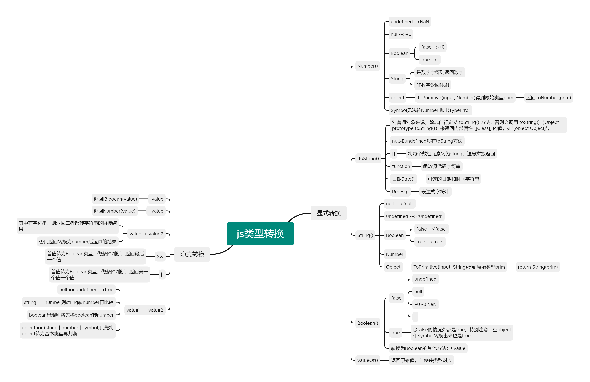

## 思维导图



## 显示转换

### Number(value)

| 规范                                                         |
| :----------------------------------------------------------- |
| [ECMAScript (ECMA-262) Number constructor](https://tc39.es/ecma262/#sec-number-constructor) |

除了BigInt类型外，都按ToNumber(value)的规范转。


- Undefined --> NaN
- Null --> +0
- Boolean：true-->1，false-->+0
- String，如果全数字字符则转换为数字，如果包含非数字字符则转换为 NaN，空字符串为 0。
- Symbol，不能转，抛出TypeError

- **BigInt，直接返回**
- Object
  - 调用ToPrimitive(input, number)[(函数说明,ctrl+左键访问)](#ToPrimitive )，转换为基础数据类型的值primValue（先valueOf()再toString()）
  - 返回ToNumber(primValue)

### String()与.toString()

- String（value）

  | 规范                                                         |
  | :----------------------------------------------------------- |
  | [ECMAScript (ECMA-262) String constructor](https://tc39.es/ecma262/#sec-string-constructor-string-value) |

  - 除了Symbol类型的值直接转换，其他按ToString规范转换。

    - ```js
      let s = Symbol('a')
      console.log(String(s)) //'Symbol(a)'
      ```

  - undefined --> 'undefined'

  - null -->'null'

  - true-->'true',false-->'false'

  - Number类型

    - 按[ESMA262-Number::toString(x)](https://tc39.es/ecma262/#sec-numeric-types-number-tostring)转换

    - ```js
      String(-0),String(+0) ->'0'
      String(NaN) -> 'NaN'
      String(Infinity)  -> "Infinity"
      String(3.3e-7) -> "3.3e-7"
      String(1000000000000000000000) -> "'1e+21'"
      ```

  - Object --> 若value.toString()为原始值则返回，否则再尝试value.toString().valuOf()，为原始值则返回，否则TypeError

  - 

- .toString()

  - 对普通对象来说，除非自行定义 toString() 方法，否则会调用 toString()（Object.prototype.toString()）来返回内部属性 [[Class]] 的值，如"[object Object]"。如果对象有自己的 toString() 方法，字符串化时就会调用该方法并使用其返回值。

  - [].toString()，将每个数组元素转为string，逗号拼接返回

  - function.toString()，返回函数源代码字符串

  - RegExp，Date也重写了toString方法

    ```js
    let o = {'obj1':1}
    o.toString()  // '[object Object]'
    
    let r = /\w+/g
    console.log(r.toString()) // '/\\w+/g'
    
    let a = [1,2,3,{}]
    console.log(a.toString()) // '1,2,3,[object Object]'
    
    let d = new Date()
    console.log(d.toString()) // ''Wed Apr 13 2022 12:02:48 GMT+0800 (中国标准时间)''
    ```

- 不同点在于，null和undefined没有.toString()方法

### Boolean()

| 规范                                                         |
| :----------------------------------------------------------- |
| [ECMAScript (ECMA-262) Boolean constructor](https://tc39.es/ecma262/#sec-boolean-constructor-boolean-value) |


除了以下转为false，理论上都转为true

- undefined
- null
- +0,-0,NaN
- ""

```js
//注意以下转换
Boolean([]) //true
Boolean({}) //true
```

### Object()与valueOf()

在 JavaScript 中，基本类型是没有属性和方法的，但是为了便于操作基本类型的值，在调用基本类型的属性或方法时 JavaScript 会在后台隐式地将基本类型的值转换为对象，如：

```js
const a = "abc";
a.length; // 3
a.toUpperCase(); // "ABC"
```

在访问`'abc'.length`时，JavaScript 将`'abc'`在后台转换成`String('abc')`，然后再访问其`length`属性。

JavaScript也可以使用`Object`函数显式地将基本类型转换为包装类型：

```js
var a = 'abc'
Object(a) // String {"abc"}
```

也可以使用`valueOf`方法将包装类型倒转成基本类型：

```js
var a = 'abc'
var b = Object(a)
var c = b.valueOf() // 'abc'
```

看看如下代码会打印出什么：

```js
var a = new Boolean( false );
if (!a) {
    console.log( "Oops" ); // never runs
}
```

答案是什么都不会打印，因为虽然包裹的基本类型是`false`，但是`false`被包裹成包装类型后就成了对象，所以其非值为`false`，所以循环体中的内容不会运行。

### 

<span id="ToPrimitive "> </span>**ToPrimitive ( input [ , preferredType ] )**

- 将input转换为non-object类型并返回

- 第二个参数代表期望转换的类型，非必填，可选string|number，除了Date类型默认为string外，其他情况默认为number
- input为基本类型，则直接返回input
- preferredType === string ：先调用.toString()，再调用valueOf()。一旦转为基本类型则返回，最终也没有转为原始值则TypeError
- preferredType === number：先调用valueOf()，再调用.toString()。一旦转为基本类型则返回，最终也没有转为原始值则TypeError


## 隐式转换

### +value

return Number(value)

### !value

return !Boolean(value)。因此将一个值转换为Boolean类型的方法还可以使用`!!value`

### value1 + value2

先ToPrimitive(value1), 和ToPrimitive(value2)得到原始类型。只要有一个为string则两边都ToString并做字符串拼接。否则ToNumber()做运算。

```js
1 + '23' // '123'
1 + false // 1 
1 + Symbol() // Uncaught TypeError: Cannot convert a Symbol value to a number
'1' + false // '1false'
false + true // 1
```

```js
var a = {name:'Jack'}
var b = {age: 18}
a + b // "[object Object][object Object]"

a.valueOf() // {}，上面提到过，ToPrimitive默认type为number，所以先valueOf，结果还是个对象，下一步
a.toString() // "[object Object]"
b.valueOf() // 同理
b.toString() // "[object Object]"
a + b // "[object Object][object Object]"
```

除了+法的 -*/其中一方为number则另一方也转换为number。

### value1 == value2

对于 `==` 来说，如果对比双方的类型**不一样**，就会进行**类型转换**。假如对比 `x` 和 `y` 是否相同，就会进行如下判断流程：

1. 首先会判断两者类型是否**相同，**相同的话就比较两者的大小；
2. 类型不相同的话，就会进行类型转换；
3. 会先判断是否在对比 `null` 和 `undefined`，是的话就会返回 `true`
4. 判断两者类型是否为 `string` 和 `number`，是的话就会将字符串转换为 `number`

```js
1 == '1'
      ↓
1 ==  1
```

5. 判断其中一方是否为 `boolean`，是的话就会把 `boolean` 转为 `number` 再进行判断

```js
'1' == true
        ↓
'1' ==  1
        ↓
 1  ==  1
```

6. 判断其中一方是否为 `object` 且另一方为 `string`、`number` 或者 `symbol`，是的话就会把 `object` 转为原始类型再进行判断

```js
'1' == { name: 'js' }
        ↓
'1' == '[object Object]'
```

其流程图如下：


```js
"1,2,3"==[1,2,3] //true

// string  == object，将obejet转换为基本类型
[1,2,3].toString() //"1,2,3"
"1,2,3" == "1,2,3" //true
```


### value1 || value2

- 首先会对第一个操作数执行条件判断，如果其不是布尔值就先强制转换为布尔类型，然后再执行条件判断。
- 返回第一个值

### value1 && value2

- 首先会对第一个操作数执行条件判断，如果其不是布尔值就先强制转换为布尔类型，然后再执行条件判断。
- 返回最后一个值

### value1 > value2 ,value1 < value2

操作符两边的值都尽量转成`number`：

```js
3 == true // false, 3 转为number为3，true转为number为1
'0' == false //true, '0'转为number为0，false转为number为0
'0' == 0 // '0'转为number为0
```

4. 对于**`**<**`**和**`**>**`**比较符

如果两边都是字符串，则比较字母表顺序：

```js
'ca' < 'bd' // false
'a' < 'b' // true
```

其他情况下，转换为数字再比较：

```js
'12' < 13 // true
false > -1 // true
```

以上说的是基本类型的隐式转换，而对象会被`ToPrimitive`转换为基本类型再进行转换：

```js
var a = {}
a > 2 // false
```

## 参考文献

- [js基本类型、显示转换，隐式转换 - 掘金 (juejin.cn)](https://juejin.cn/post/6949527975595360269#heading-9)
- [ECMAScript® 2023 Language Specification](https://tc39.es/ecma262/)

