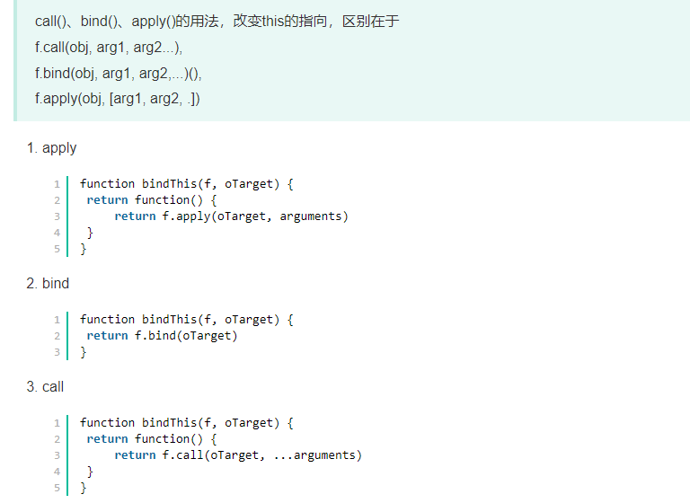
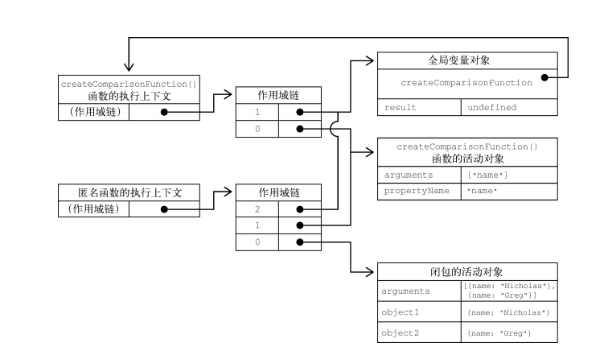

# 第10章 函数

**本章内容**
函数表达式、函数声明及箭头函数
默认参数及扩展操作符
使用函数实现递归
使用闭包实现私有变量

函数实际上是对象，函数名就是指向函数的指针，意味着一个函数可能有多个名称。使用不带括号的函数名会访问函数指针，而不会执行函数，函数声明后带括号就是直接执行。

## 定义函数的4种方式

```javascript
//1.函数声明
function sum (num1, num2) {
 return num1 + num2;
}

//2.函数表达式，这里，代码定义了一个变量sum并将其初始化为一个函数。
let sum = function(num1, num2) {
	return num1 + num2;
};

//3.箭头函数，ES6新增，箭头函数不能使用arguments、super和new.target，也不能用作构造函数。此外，箭头函数也没有prototype属性。
let sum =  (num1, num2) => {
	return num1 + num2;
};

//4.Function构造函数，这个构造函数接收任意多个字符串参数，最后一个参数始终会被当成函数体，而之前的参数都是新函数的参数。
let sum = new Function("num1", "num2", "return num1 + num2"); // 不推荐
```

## 函数参数

* ECMAScript函数既不关心传入的参数个数，也不关心这些参数的数据类型。函数的参数在内部表现为一个数组。函数被调用时总会接收一个数组，但函数并不关心这个数组中包含什么。
* 在函数体内可以使用arguments对象访问参数，arguments对象是一个类数组对象（但不是Array的实例），因此可以使用中括号语法访问其中的元素（arguments[0], arguments[1]...超出传入个数则会显示undefine）。也可以通过arguments.length属性检查传入的参数个数。**arguments对象的长度是根据传入的参数个数，而非定义函数时给出的命名参数个数确定的。** arguments对象可以和命名参数一起使用并保持同步。箭头函数无法使用 arguments对象。在使用默认参数时(ES6新增)，arguments对象的值不反映参数的默认值，只反映传给函数的参数。
* 默认参数值并不限于原始值或对象类型，也可以使用调用函数返回的值。参数是按顺序初始化的，所以后定义默认值的参数可以引用先定义的参数。暂时性死区（先定义的参数引用后面的参数会抛出错误）。参数不能引用函数体的作用域。

## 参数扩展与收集

* 将传递的数组转变为一个个元素分别传入

  * ```javascript
    let values = [1, 2, 3, 4];
    //es5的方法
    console.log(getSum.apply(null, values)); // 10
    //es6扩展方法
    console.log(getSum(...values)); // 10
    //因为数组的长度已知，所以在使用扩展操作符传参的时候，并不妨碍在其前面或后面再传其他的值
    console.log(getSum(-1, ...values)); // 9
    console.log(getSum(...values, 5)); // 15
    console.log(getSum(-1, ...values, 5)); // 14
    console.log(getSum(...values, ...[5,6,7])); // 28
    ```
* 将传入的不同长度的独立参数组合为1个数组

  * ```javascript
    function getSum(...values) {
    // 顺序累加values中的所有值
    // 初始值的总和为0
      return values.reduce((x, y) => x + y, 0);
    }
    //收集参数的前面如果还有命名参数，将参数依次赋给命名参数再收集剩余参数；如果收集参数的长度可变，所以只能把它作为最后一个参数
    function ignoreFirst(firstValue, ...values) {
      console.log(values);
    }
    ignoreFirst(); // []
    ignoreFirst(1); // []
    ignoreFirst(1,2); // [2]
    ignoreFirst(1,2,3); // [2, 3]
    ```

## 函数声明与函数表达式的执行差异

* 在js引擎中，函数声明会在任何代码执行之前先读取函数声明（函数声明提升）。因此在代码结构中，即使在函数声明代码前调用函数也可以正常执行。
* 函数表达式必须等到代码执行它的那一行，才会在执行上下文中生成函数定义

## 函数属性和方法

### 函数内部属性和对象

* arguments
  适用于用function关键字定义的函数。类数组对象，包含调用时传入的所有参数。当在函数内调用自身时，可以使用arguments.callee进行调用（将函数名称与函数解耦，是递归函数写法的首选)，这样可以保证函数名不论如何改变都能调用到自身，但在严格模式下callee会报错。
* this
  在标准函数中，this引用的是**将函数当成方法调用**的上下文对象。而在箭头函数中引用的是**定义箭头函数**的上下文。
  * ```javascript
    window.color = 'red';
    let o = {
      color: 'blue'
    };

    //标准函数
    function sayColor() {
      console.log(this.color);
    }
    sayColor(); // 'red' // this引用window中的color
    o.sayColor = sayColor;
    o.sayColor(); // 'blue'  this引用o中的color

    //箭头函数,由于是在window中定义的箭头函数，因此无论何时用saycolor引用的都是window中的color
    let sayColor = () => console.log(this.color);
    sayColor(); // 'red'
    o.sayColor = sayColor;
    o.sayColor(); // 'red'

    ```
* caller
  引用的是调用当前函数的函数，如果在全局作用域中调用则为null。严格模式下还有一个限制，就是不能给函数的caller属性赋值，否则会导致错误。
  * ```javascript
    function outer() {
    inner();
    }
    function inner() {
    console.log(arguments.callee.caller); //inner.caller
    }
    outer();

    //上代码会显示outer()函数的源代码。这是因为ourter()调用了inner。arguments.callee指向outer()
    ```
* new.target
  ECMAScript中的函数始终可以作为构造函数实例化一个新对象，也可以作为普通函数被调用。可以用new.target检测函数是否是new出来的，返回值为布尔值。？？？为啥要new--类和类对象

### 函数本身的属性和方法

* length：保存函数定义的命名参数的个数
* apply：函数.apply(函数内this对象的值， 参数数组/arguments对象)
* call: 函数.call(函数内部this对象的值， 参数1，参数2， 参数3....)。call和apply都能便捷的转变函数内的this对象。
* bind: 函数.bind(this值的对象)，bind()方法会创建一个新的函数实例，其this值会被绑定到传给bind()的对象。
  * ```javascript
    window.color = 'red';
    var o = {
      color: 'blue'
    };
    function sayColor() {
      console.log(this.color);
    }
    //sayColor()上调用bind()并传入对象o创建了一个新函数objectSayColor()。objectSayColor()中的this值被设置为o，因此直接调用这个函数，即使是在全局作用域中调用，也会返回字符串"blue"。
    let objectSayColor = sayColor.bind(o);
    objectSayColor(); // blue 
    ```
* 

## 递归函数

使用arguments.callee在严格模式下会报错，此时可以使用命名函数表达式达到目的，这种写法在严格模式和非严格模式都有用。

```javascript
//创建命名函数表达式f()再赋值给变量factorial。
const factorial = (function f(num) {
   if (num <= 1) {
   return 1;
} else {
   return num * f(num - 1);
}
});
```

## 闭包（closure）

定义：闭包值引用另一个函数作用域中的变量的函数通常是在嵌套函数中实现的，被嵌套的函数的作用域包含嵌套其的函数的作用域，如下图所示。

```javascript
function createComparisonFunction(propertyName) {
  return function(object1, object2) {
  let value1 = object1[propertyName];
  let value2 = object2[propertyName];
  if (value1 < value2) {
    return -1;
   } else if (value1 > value2) {
    return 1;
   } else {
   return 0;
   }
  };
}
var a = createComparisonFunction()
```



* [ ] 用闭包实现私有对象的访问
