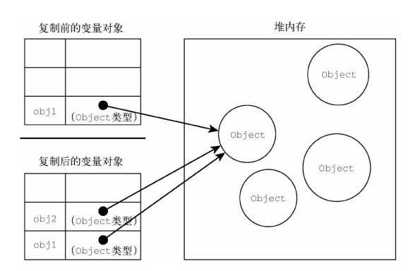

# 第4章 变量、作用域

**1. 原始值：**

* Undefined、Null、Boolean、Number、String和Symbol。按值访问。
* 不能动态添加属性（除非使用new关键字初始化，此时会创建一个Obj类型的实例）。
* =复制时，原始值复制到新变量的位置，两个变量单独使用，**互不干扰**。

**2. 引用值：**

* 是保存在内存中的对象（js不允许直接访问内存）。按引用访问。
* 可以动态添加属性。
* =复制值时，复制的只是一个指针，该指针指向存储在堆内存中的对象。因此两个变量指向同一个对象，**互相影响**。

**3. 传递参数**
   ES中所有函数都是按值传递的。只不过和复制值时的不同一样。原始值直接复制变量，而引用值复制的时指针，因此函数内的操作可能也同时影响外部的变量。

```javascript
   function setName(obj) {
       obj.name = "Nicholas";
       obj = new Object();
       obj.name = "Greg";
   }
   let person = new Object();
   setName(person);
   console.log(person.name); // "Nicholas"
```

**4. 确定类型**

* typeof：如果值是对象或者null返回'Object'。其他返回各自原始值的类型。
* instanceof：可以返回具体是什么类型的对象。

  ```javascript
  console.log(person instanceof Object); // 变量person是Object吗？
  console.log(colors instanceof Array); // 变量colors是Array吗？
  console.log(pattern instanceof RegExp); // 变量pattern是RegExp吗？
  ```

**5. 变量声明**

* var声明时变量自动添加到最接近的上下文。声明提升。
* 未声明就初始化则添加到全局作用域。
* let，块级作用域，且同一作用域内不能声明两次（SyntaxError),var重复声明则会被忽略。
* const在初始化时就应赋值，且任何时候都不能重新复值。当被赋值为对象时，不能重新赋值为其他引用值，但对象内的键不受影响。
